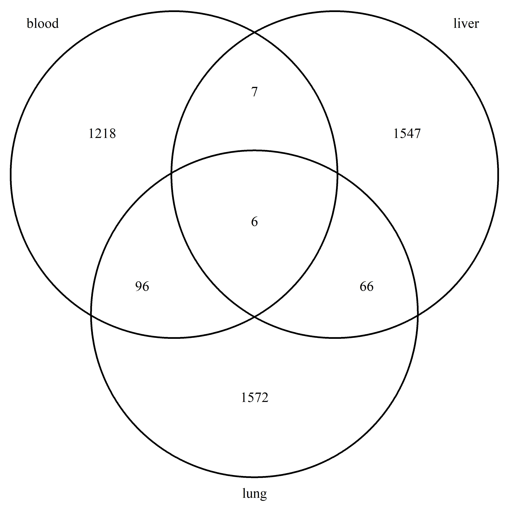

```{r setup, include=FALSE}
knitr::opts_chunk$set(echo = TRUE)
```
# Age prediction
Age prediction was done with scEpiAge blood clock.
Used parameters
tissue="blood"
nSimulations = 5
```{r, warning=FALSE, message=FALSE}
setwd("~/R/meSIT_seq_and_scEpiAge_validation/scEpiAge")
options(bitmapType='cairo')
library(ggplot2)
library(dplyr)
library(VennDiagram)
```


```{r}
# Setting the analysed tissue to blood
tissue = "blood"
# Retirieving the results from age predictions made with blood clock from custom 
# library samples (S183)
file <- "extended_predS183_blood.txt"
```


```{r functions for age predictions, echo=FALSE, warning=FALSE, message=FALSE}
create_predictions_df <- function(file){
  # Function for reading the age prediction data into a dataframe. 
  data <- read.delim(file)
  
  #extract tissue txpe
  tissueType <- sub(".*_(\\w+)_r\\d+_.*", "\\1", rownames(data))
  data$TissueType <-tissueType
  
  return(data)
}
# Age deviation is actually the same as absolute error
calculate_avg_errors <- function(data){
  # Function to calculate average errors by tissue type 
  avg_error_by_tissue <- data %>%
    group_by(TissueType) %>%
    summarize(AvgAbsoluteError = mean(ageDeviation))
  return(avg_error_by_tissue)
}

calculate_avg_relative_errors <- function(data){
  # Function to calculate average relative errors by tissue type 
  # This function takes into count how large the error is compared to the 
  # actual age
  
  #Calculate relative error
  data$relativeError <- 
    ((data$predictedAge - data$actualAge)/data$actualAge)*100
  
  avg_r_error_by_tissue <- data %>%
    group_by(TissueType) %>%
    summarize(AvgRelativeError = mean(relativeError))
  
  return(avg_r_error_by_tissue)
}

residual_hist <- function(data){
  #Function to plot the frequency histogram of residuals i.e. the agedeviations 
  
}

age_pred_plot <- function(data, clock, point_size=3){
  # Plot actual age vs. predicted age using ggplot
  ggplot(data, aes(x = actualAge, y = predictedAge)) +
    geom_point(aes(color = TissueType, shape = TissueType), 
               alpha=0.7, size=point_size) +
    scale_color_manual(values = c("BAT" = "#710C32", 
                                  "Blood" = "#2978a0", 
                                  "Liver" = "#68CBAC", 
                                  "scAT" = "#fc8d62")) +
    scale_shape_manual(values = c("BAT" = 19, "Blood" = 17, 
                                  "Liver" = 15, "scAT" = 8)) +
    ylim(0,135) +
    # Add linear trendlines
    geom_smooth(aes(color=TissueType),
                method = "lm", se = FALSE, 
                linewidth = 0.7, linetype="dashed") +  
    labs(title = paste0("Age prediction (", clock, " clock)"), 
         x="Chronological age", 
         y= "Predicted age", 
         color="Tissue regression") +
    geom_abline(intercept = 0, slope = 1, linetype = "solid", color = "black")+
    guides(color = guide_legend(override.aes = list(shape = c(19, 17, 15, 8)),
                                title = "Tissue sample",
                                title.position = "top"), shape = "none")+
    theme_minimal()+
    theme(legend.background = element_rect(fill = "white", colour = "grey", linewidth = 0.5),
          legend.justification = c(0, 1),  # Justify legend position to the top-right
          legend.position = c(0, 1),       # Position legend inside the plot at the top-right
          )
}

# Function to plot ageDeviation vs. actual age using ggplot
deviation_plot <- function(data, clock){
  if (length(unique(data$TissueType)) == 4){
    shapelist = c(19, 17, 15, 8)
  }
  else if (length(unique(data$TissueType)) < 4){
    shapelist = c(17)
  }
  ggplot(data, aes(x = actualAge, y = ageDeviation, 
                   color = TissueType,shape = TissueType)) +
    geom_point() +
    labs(title = paste("Absolute error:",clock,"clock"),
           x="Chronological age", 
           y= "Absolute error", 
           color="Tissue" ) +
    scale_shape_manual(values = c("BAT" = 19, "Blood" = 17, 
                                  "Liver" = 15, "scAT" = 8)) +
    scale_color_manual(values = c("BAT" = "#710C32", 
                                    "Blood" = "#2978a0", 
                                    "Liver" = "#68CBAC", 
                                    "scAT" = "#fc8d62"))+
      # Add linear trendlines
    geom_smooth(aes(color=TissueType),
                  method = "lm", se = FALSE, linewidth = 0.7, linetype="dashed") +
    guides(shape = "none")+
    guides(color = guide_legend(override.aes = list(shape = shapelist),
                                       title = "Tissue sample",
                                       title.position = "top"), 
                                       shape = "none")+
    theme_minimal()
}

#Function for getting the rownames to make a Venn diagram of the clock sites
get_rownames <- function(tissue){
  if(tissue=="liver"){
  expectedMethMatrix <- 
    read.delim("./ExpectedMethylationMatrices/ExpectedMethMat_Liver.tsv",
               as.is=T,row.names=1,check.names = F)
  } else if(tissue=="lung"){
  expectedMethMatrix <- 
    read.delim("./ExpectedMethylationMatrices/ExpectedMethMat_Lung.tsv",
               as.is=T,row.names=1,check.names = F)
 } else if(tissue=="blood"){
  expectedMethMatrix <- 
    read.delim("./ExpectedMethylationMatrices/ExpectedMethMat_Blood.tsv",
               as.is=T,row.names=1,check.names = F)
 }
  return(rownames(expectedMethMatrix))
}

deviation_histogram <- function(data, clock) {
  ggplot(data, aes(x = predictedAge-actualAge, fill = TissueType)) +
    geom_histogram(binwidth = 6, position = "dodge", alpha = 0.7) +
    labs(title = paste("Error histogram:", clock, "clock"),
         x = "Error",
         y = "Frequency",
         fill = "Tissue") +
    scale_fill_manual(values = c("BAT" = "#710C32",
                                 "Blood" = "#2978a0",
                                 "Liver" = "#68CBAC",
                                 "scAT" = "#fc8d62")) +
    theme_minimal()
}

IQR_ratio_histogram <- function(data, clock) {
  ggplot(data, aes(x = IQR_Ratio, fill = TissueType)) +
    geom_histogram(binwidth = 4, position = "dodge", alpha = 0.7) +
    labs(title = paste("IQR histogram:", clock, "clock"),
         x = "IQR Ratio",
         y = "Frequency",
         fill = "Tissue") +
    scale_fill_manual(values = c("BAT" = "#710C32",
                                 "Blood" = "#2978a0",
                                 "Liver" = "#68CBAC",
                                 "scAT" = "#fc8d62")) +
    theme_minimal()
}

# plot for comparing replicates
replicate_boxplot <- function(data,point_size,point_shape){
  
  # Extracting sample name
  pattern <- "MethRate_(\\d+_\\w+)_r\\d+.*"
  sampleName <- sub(pattern, "\\1", rownames(data))
  
  # Add the sample name to the data frame
  data$sampleName <- sampleName
  
  data <- data %>% 
    arrange(actualAge) 
  
  # Calculate the number of replicates for each sample
  replicate_counts <- data %>% 
    group_by(sampleName) %>% 
    summarize(n = n())
  #print(replicate_counts) # uncomment if you want to see the numbers
  
  unique_samples <- data %>%
    distinct(sampleName, actualAge)
  
  ggplot(data, aes(x = sampleName, y = predictedAge)) +
    geom_boxplot(size=0.4) +
    geom_point(data = unique_samples, aes(x = sampleName, y = actualAge)
              , color="#2978a0", size=point_size, shape = point_shape) +
    theme_minimal() +
    theme(axis.text.x = element_text(angle = 90, hjust = 1)) +
    labs(title = "Predicted age of technical replicates",
         x = "Sample name",
         y = "Predicted age")
}
```


## Blood Clock
Here the predictions are plotted and linear regression lines are produced to provide visualizations of the relationships between actualAge and predictedAge. 

```{r blood clock data}
# Retrieve predictions
blood_clock_data <- create_predictions_df("extended_predS183_blood.txt")
# Calculate errors
errors <- calculate_avg_errors(blood_clock_data)
relative_errors <- calculate_avg_relative_errors(blood_clock_data)

age_pred_plot(blood_clock_data, "Blood")
```
```{r ageDeviation blood tissue data}
# Make a subset for blood sample age predictions with blood clock
subset_blood_data <- blood_clock_data %>%
  subset(TissueType == "Blood")
# Plot age deviation for this subset
deviation_plot(subset_blood_data, "Blood")
```

## Comparing the age predicitions of technical replicates

Comparing the replicates of all the tissue samples in custom library with blood clock. 
```{r plot or comparing blood clock samples}
replicate_boxplot(blood_clock_data,2,20)
```

Only blood sample comparison. All blood samples had three replicates.

```{r plot or comparing blood replicates}
replicate_boxplot(subset_blood_data,2,17)
```


```{r abs error histogram blood}
# Example usage:
deviation_histogram(blood_clock_data, "Blood")

```
```{r ageDeviation blood clock data}
deviation_plot(blood_clock_data, "Blood")
```

### IQR analysis

```{r}
IQR_ratio_histogram(blood_clock_data, "Blood")
```

## Liver clock

### Predictions

Plots of age predictions made with liver clock. Samples are from the Custom library.
```{r liver clock data}
# Retrieve predictions
liver_data <- create_predictions_df("extended_predS183_liver.txt")
# Calculate errors
errors <- calculate_avg_errors(liver_data)
relative_errors <- calculate_avg_relative_errors(liver_data)

age_pred_plot(liver_data, "liver", point_size = 2)
```

### Deviations

```{r ageDeviation liver clock data}
deviation_plot(liver_data, "liver")
```

## Lung clock 

### Predictions
Plots of age predictions made using the lung clock. Samples are from the Custom library.
```{r lung clock data}
# Retrieve predictions
lung_data <- create_predictions_df("extended_predS183_lung.txt")
# Calculate errors
errors <- calculate_avg_errors(lung_data)
relative_errors <- calculate_avg_relative_errors(lung_data)

age_pred_plot(lung_data, "lung",point_size=2)
```

### Deviations

```{r ageDeviation lung clock data}
deviation_plot(lung_data, "lung")
```

# R-squared analysis

In the column R-squared clock the scEpiAge R-squared is calculated on our test data. This assesses the accuracy of the model in the clock.

In the column R-squared linear the R-squared for linear fit is shown. This measures how well the prediction data follows the linear model and gives an idea of the correlation between actual age and predicted age. If there is some causality between the age and measured parameters, it would be expected that the predictions follow some function. Therefore a good R-squared indicates we can improve the predictions of the clock by making a simple linear transformation and additionally we know it is measuring the correct thing.
```{r Rsquared analysis, echo=FALSE, warning=FALSE, message=FALSE}
# Create a function to calculate R-squared for a specific tissue group
calculate_r_squared_of_clock <- function(data) {
  # Step 1 Calculate the Mean Squared Error (MSE) of your model
  mse_model <- mean((data$actualAge - data$predictedAge)^2)

  # Step 2 Calculate the MSE of the mean (baseline model)
  mse_mean <- mean((data$actualAge - mean(data$actualAge))^2)

  # Step 3 Calculate R-squared
  r_squared <- 1 - (mse_model / mse_mean)
  
  return(r_squared)
}

calculate_r_squared_lm <- function(data){
  model <- lm(actualAge ~ predictedAge, data = data)
  
  # Summarize the model to get R-squared and other statistics
  model_summary <- summary(model)
  
  # Extract R-squared value
  r_squared <- model_summary$r.squared
  return(r_squared)
}

# Initialize an empty list to store results
r_squared_results_df <- data.frame()

# Get unique tissue types
unique_tissues <- unique(blood_clock_data$TissueType)

# Iterate over each tissue group
for (tissue in unique_tissues) {
  # Filter data for the current tissue
  current_data <- dplyr::filter(blood_clock_data, TissueType == tissue)
  
  # Calculate R-squared of the clock for the current tissue
  r_squared_value_clock <- calculate_r_squared_of_clock(current_data)
  
  # Calculate the R_squared of a linear fit
  r_squared_linear <- calculate_r_squared_lm(current_data)
  
  # Store the result in a data frame
  r_squared_results_df <- rbind(r_squared_results_df, data.frame(
    Tissue = tissue,
    `R-squared clock` = r_squared_value_clock,
    `R-squared linear` = r_squared_linear, check.names = FALSE
  ))
}


```


```{r}
# Sort the data frame by 'R squared Linear' column in descending order
r_squared_results_df <- r_squared_results_df[order(r_squared_results_df$`R-squared linear`, decreasing = TRUE), ]

print(r_squared_results_df)

```


```{r}

```


# Clock sites analysis

```{r Clock sites function, echo=FALSE, warning=FALSE, message=FALSE}
# compare the number of sites
# Read data files
data_blood <- read.delim("extended_predS183_blood.txt")
data_liver <- read.delim("extended_predS183_liver.txt")
data_lung <- read.delim("extended_predS183_lung.txt")
data_lung$clockType <- "Lung"
data_blood$clockType <- "Blood"
data_liver$clockType <- "Liver"
#print(data_lung)
# Combine the data frames
data_combined <- rbind(data_blood, data_liver, data_lung)
# Plot

# Organize clockType in the desired order
data_combined$clockType <- factor(data_combined$clockType, levels = c("Blood", "Lung", "Liver"))

# Plot a boxplot
site_plot <- ggplot(data_combined) +
  geom_boxplot(aes(x = clockType, y = sitesUsed, fill = clockType),size=0.3,outlier.size = 0.75) +
  labs(title = "Number of sites used in predicition", fill="Clock", y="Sites used by clock", x="Clock type") +
  scale_fill_manual(values = c("Blood" = "#2978a0", 
                                "Liver" = "#68CBAC", 
                                "Lung" = "#E69F00"))+
  theme_minimal()
```


```{r Clock sites}
site_plot
```
```{r clock sites overlap}
blood_sites <- get_rownames("blood")
liver_sites <- get_rownames("liver")
lung_sites <- get_rownames("lung")

# Create a list of sets
venn_list <- list(
  "blood" = blood_sites,
  "liver" = liver_sites,
  "lung" = lung_sites
)

# Helper function to display Venn diagram
display_venn <- function(x, ...){
  library(VennDiagram)
  grid.newpage()
  venn_object <- venn.diagram(x, filename = NULL, ...)
  grid.draw(venn_object)
}

display_venn(
        venn_list,
        category.names = c("Blood clock" , "Liver clock" , "Lung clock"),
        # Circles
        lwd = c(length(blood_sites)/length(lung_sites), length(liver_sites)/length(lung_sites), length(lung_sites)/length(lung_sites))/5,
        lty = 'blank',
        fill = c("#2978a0", "#68CBAC", "#E69F00"),
        # Numbers
        cex = .9,
        fontface = "italic",
        # Set names
        cat.cex = 1,
        #cat.fontface = "bold",
        cat.default.pos = "outer",
        cat.dist = c(0.065, 0.065, 0.055)
)
# Create the Venn diagram
#venn <- venn.diagram(venn_list,filename = "Venn_diagram_of_clock_sites.png")

```


```{r}
if (!require(devtools)) install.packages("devtools")
devtools::install_github("yanlinlin82/ggvenn")


library(ggvenn)
ggvenn(
  venn_list, 
  fill_color = c("#0073C2FF", "#EFC000FF", "#CD534CFF"),
  stroke_size = 0.5, set_name_size = 4
  )
```

